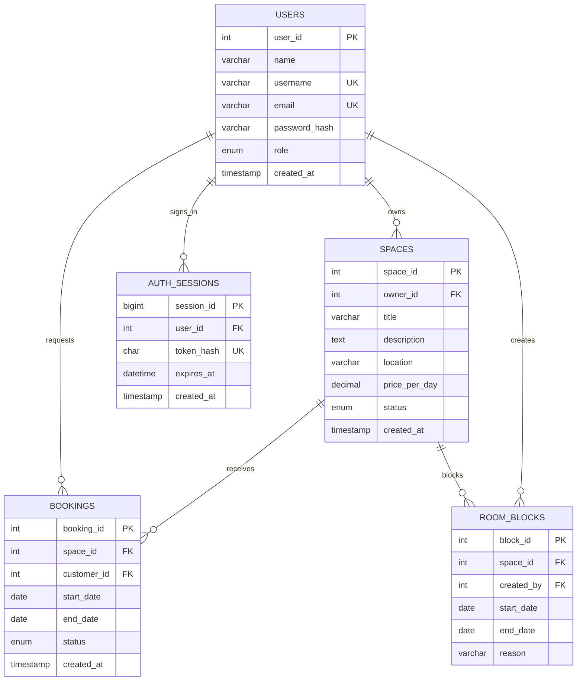

# ERD and data dictionary

## ERD

```mermaid
erDiagram
    USERS ||--o{ SPACES : owns
    USERS ||--o{ BOOKINGS : requests
    SPACES ||--o{ BOOKINGS : receives
    SPACES ||--o{ ROOM_BLOCKS : blocks
    USERS ||--o{ ROOM_BLOCKS : creates
    USERS ||--o{ AUTH_SESSIONS : signs_in

    USERS {
        int user_id PK
        varchar name
        varchar username UK
        varchar email UK
        varchar password_hash
        enum role
        timestamp created_at
    }
    SPACES {
        int space_id PK
        int owner_id FK
        varchar title
        text description
        varchar location
        decimal price_per_day
        enum status
        timestamp created_at
    }
    BOOKINGS {
        int booking_id PK
        int space_id FK
        int customer_id FK
        date start_date
        date end_date
        enum status
        timestamp created_at
    }
    ROOM_BLOCKS {
        int block_id PK
        int space_id FK
        int created_by FK
        date start_date
        date end_date
        varchar reason
    }
    AUTH_SESSIONS {
        bigint session_id PK
        int user_id FK
        char token_hash UK
        datetime expires_at
        timestamp created_at
    }
```
